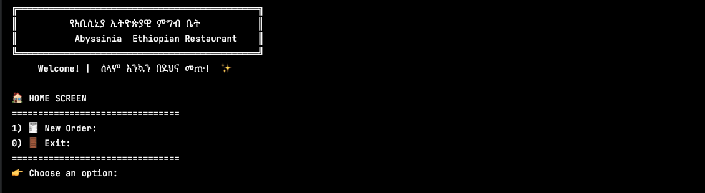
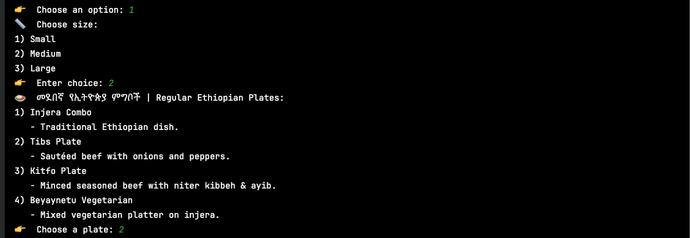
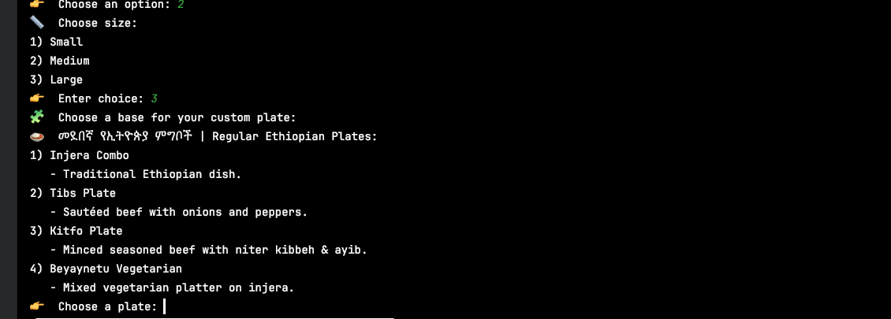
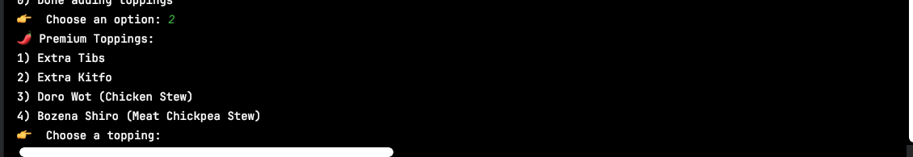
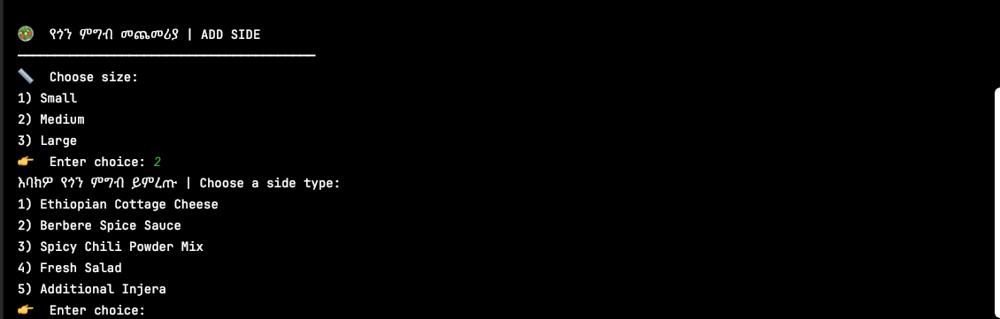
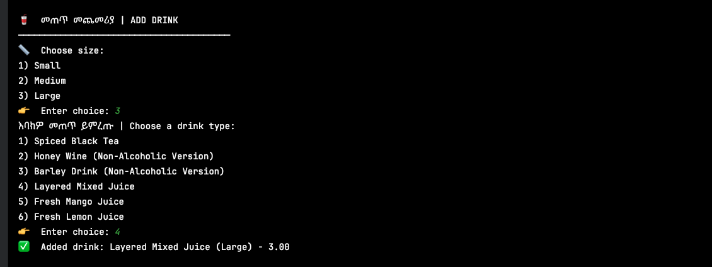
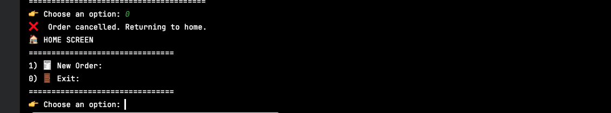

---

# 🍽️ Abyssinia Ethiopian Restaurant – Ordering System

A complete Java-based console application that allows users to build authentic Ethiopian food orders with customizable plates, sides, drinks, and detailed receipts.
This project highlights clean OOP, interfaces, inheritance, enums, and file handling in Java.
---

## 🧑‍💻 Author

**Hana Atinaf**
*Created as part of the Java Focus Academy program (Capstone-style project).*

---
# 🎥 GIF Demo


https://github.com/user-attachments/assets/434de8a8-da10-4dc0-bdbe-3c02380c4f2d


## 📋 Table of Contents

* ✨  [Features](#features)
* [Project Structure](#project-structure)
* [Installation](#installation)
* [Usage](#usage)
* [Main Menu Navigation](#main-menu-navigation)
* [Code Overview](#code-overview)
* [UML Diagram](#uml-diagram)
* [Sample Output](#sample-output)
* [GIF Demo](#gif-demo)
* [Technologies Used](#technologies-used)
* [Key Features Demonstrated](#key-features-demonstrated)

---

# ✨ Features

### 🏠 **Home Screen**

* Start new orders
* Exit safely with bilingual Amharic + English messages

### 🍛 **Ethiopian Plates**

* Injera Combo
* Tibs Plate
* Kitfo Plate
* Beyaynetu Vegetarian
* Custom plates with toppings (Regular + Premium + Extra)

### 🧩 **Customization System**

* Size selection
* Base plate selection
* Regular toppings
* Premium toppings
* Extra charges
* Dynamic price calculation

### 🥤 **Drinks**

* Shai
* Tej (Non-Alcoholic)
* Tella (Non-Alcoholic)
* Spris
* Mango Juice
* Lemon Juice
* Size-based pricing

### 🥗 **Sides**

* Ayib
* Awaze
* Mitmita
* Salad
* Additional Injera

### 🧾 **Automatic Receipt Generation**

* Timestamp order ID
* Detailed cost breakdown
* Topping breakdown
* Final total
* Saved to `/receipts/` directory

---

# 🗂️ Project Structure

```
AbyssiniaRestaurant/
└── src/com/pluralsight/
    ├── Abstract/
    │   ├── Product.java
    │   ├── Item.java
    │   └── Topping.java
    │
    ├── Classes/
    │   ├── Main.java
    │   ├── UIController.java
    │   ├── Order.java
    │   ├── ReceiptWriter.java
    │   ├── EthiopianFoodItem.java
    │   ├── FoodMenu.java
    │   ├── Drink/
    │   │   ├── Drink.java
    │   │   └── DrinkMenu.java
    │   ├── Sides/
    │   │   ├── Side.java
    │   │   └── SideMenu.java
    │   └── Toppings/
    │       ├── RegularTopping.java
    │       ├── PremiumTopping.java
    │       └── ToppingMenu.java
    │
    ├── Enum/
    │   ├── Size.java
    │   ├── FoodType.java
    │   ├── EthiopianDrinkType.java
    │   └── EthiopianSideType.java
    │
    └── Interfaces/
        ├── Priceable.java
        └── Customizable.java
```


# 🚀 Usage

When you start the application, you’ll see the Home Screen where you can create new orders, add items, and checkout.

---

# 🧭 Main Menu Navigation

### **Home Screen**



### **Order Screen**


---

# 🔧 Code Overview


### 🔹 **Abstract Classes**

* `Product`
* `Item`
* `Topping`

### 🔹 **Concrete Classes**

* `EthiopianFoodItem`, `Drink`, `Side`
* `RegularTopping`, `PremiumTopping`
* `Order`, `ReceiptWriter`, `UIController`

### 🔹 **Interfaces**

* `Priceable`
* `Customizable`

### 🔹 **Enums**

* `Size`
* `FoodType`
* `EthiopianDrinkType`
* `EthiopianSideType`

---

# 🗃️ UML Diagram


---

# 📊 Sample Output

### 🏠 Home Screen


---
### 🧾 Start New Order

---

### 🍽️ Add Ethiopian Food Item — Regular Plate


---

### 🧩 Custom Plate — Size Selection

---

### 🍛 Choose Base Plate


---

### ➕ Add Toppings


---

###  Add Regular Toppings


### 🌶️ Add Premium Toppings

---

### 🥤 Add Drink


---

### 🧺 Order Screen After Adding Items


---

### 🧾 Checkout — Receipt Preview


---

### 🥗 Add Side


---

### 🥤 Add Drink (Large)



---

### ❌ Cancel Order



---


---

# 🛠️ Technologies Used

* **Java**
* **Java Time API**
* **Scanner for user input**
* **File I/O for receipt saving**
* **Collections Framework**
* **Enums, interfaces, abstract classes**

---

# 📝 Key Features Demonstrated

1. **Object-Oriented Programming**
2. **Inheritance + Polymorphism**
3. **Interfaces for extensibility**
4. **Enum-driven domain modeling**
5. **User-friendly console UI**
6. **Factory methods**
7. **File persistence**
8. **Realistic restaurant billing system**

---
